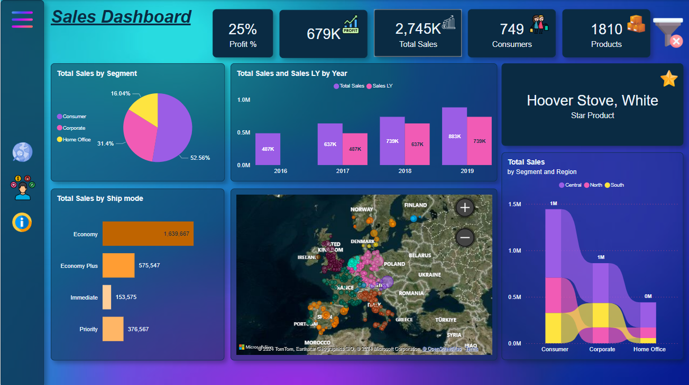

# Sales Dashboard

This project provides a **Sales Analysis Dashboard** designed to visualize key performance metrics, trends, and insights related to sales data. The dashboard is interactive and user-friendly, enabling users to monitor and analyze sales performance effectively.



---

## Features

- **Key Metrics Overview**:  
  Display essential KPIs like:
  - **Profit %**: Overall profit percentage (`25%`).
  - **Total Sales**: Total sales value (`2.745K`).
  - **Profit**: Total profit value (`679K`).
  - **Consumers**: Number of customers (`749`).
  - **Products**: Number of products sold (`1810`).

- **Sales by Segment**:  
  A pie chart categorizing sales into:
  - `Consumer`: **52.56%**
  - `Corporate`: **31.4%**
  - `Home Office`: **16.04%**

- **Sales by Ship Mode**:  
  Bar chart displaying sales performance by shipping method:
  - `Economy`
  - `Economy Plus`
  - `Immediate`
  - `Priority`

- **Sales Trends by Year**:  
  A comparative bar chart highlighting total sales and last year's sales performance across multiple years.

- **Geographical Insights**:  
  Interactive map visualizing sales distribution across European regions.

- **Star Product**:  
  Highlights the top-performing product: `"Hoover Stove, White"`.

- **Sales by Segment and Region**:  
  Stacked area chart presenting sales data segmented by regions (`Central`, `North`, `South`).

---

## Technologies Used

- **Microsoft Power BI**: For creating the interactive dashboard and visualizations.
- **OpenStreetMap and Bing Maps**: For geographical visualization.
- **DAX (Data Analysis Expressions)**: For calculated measures and custom metrics.

---

## Installation and Usage

### Prerequisites:
- **Power BI Desktop** installed on your system.
- Access to the sales dataset (contact for dataset access if needed).

### Steps:
1. Clone the repository:
   ```bash
   git clone https://github.com/zabitaguliyeva/Sales-analysis-Dashboard.git


